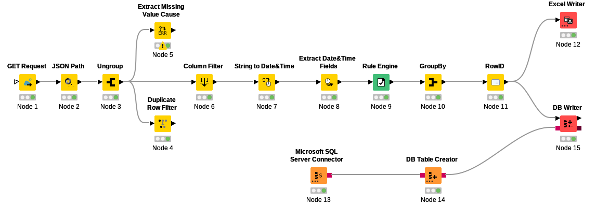

# Weather Data Pipeline & Dashboard — Porto (2002–2022)

> End-to-end data pipeline ingesting 20 years of weather data via API, storing it in a relational database, and delivering an interactive BI dashboard with strategic business insights.

---

## Project Overview

Historical weather analysis of Porto over the last 20 years (2002–2022), built for a renewables company specialised in solar and wind energy generation. The goal was to support:

- **Energy production planning** — understanding temperature and wind patterns to optimise solar panel and wind turbine performance
- **R&D strategy** — analysing precipitation trends to inform technology adaptation decisions

---

## Tech Stack

| Layer | Tool |
|---|---|
| Data Extraction | KNIME + Open-Meteo REST API |
| Data Transformation | KNIME (ETL workflow) |
| Data Storage | Microsoft SQL Server |
| Data Export | Excel (.xlsx) |
| Visualisation & BI | TIBCO Spotfire |

---

## Pipeline Architecture

```
Open-Meteo API (REST)
        |
  GET Request (KNIME)
        |
  JSON Parsing & Ungrouping
        |
  Data Cleaning
  (Missing values, duplicates, date parsing, column filtering)
        |
  Transformation
  (Date/time extraction, rule engine, GroupBy aggregation, RowID)
        |
  Load -> Microsoft SQL Server + Excel export
        |
  Spotfire Dashboard
```

---

## KNIME Workflow

The full ETL pipeline was built in KNIME. Below is the workflow diagram:



| Node | Purpose |
|---|---|
| GET Request | Connects to Open-Meteo API and retrieves raw JSON |
| JSON Path | Extracts relevant fields from the JSON response |
| Ungroup | Flattens nested JSON arrays into tabular rows |
| Extract Missing Value Cause | Identifies and flags null records |
| Duplicate Row Filter | Removes duplicate entries |
| Column Filter | Keeps only relevant columns |
| String to Date/Time | Converts date strings to proper datetime format |
| Extract Date/Time Fields | Extracts year, month, day as separate columns |
| Rule Engine | Applies business logic (e.g. solar panel performance range: 25-30C) |
| GroupBy | Aggregates data by month/year |
| RowID | Assigns unique identifiers |
| Excel Writer | Exports cleaned dataset to .xlsx |
| MS SQL Server Connector | Establishes database connection |
| DB Table Creator | Creates target table in SQL Server |
| DB Writer | Loads transformed data into SQL Server |

---

## Dataset

- **Source:** [Open-Meteo API](https://open-meteo.com/) — free historical weather API
- **Location:** Porto, Portugal
- **Period:** 2002–2022 (monthly aggregated)
- **Volume:** 252 records
- **Fields:**
  - Temperature (max, min, average) in Celsius
  - Wind speed (km/h)
  - Precipitation sum (mm)
  - Season classification

---

## Dashboard — Key Insights


The Spotfire dashboard covers four visual components:

**1. Average Temperature Over 20 Years (Line Chart)**
Tracks the evolution of average temperature year-on-year, enabling medium-term trend forecasting for solar energy planning.

**2. Average Maximum Temperature by Month (Bar Chart)**
Shows which months fall within the optimal solar panel performance range (25-30C), with reference lines marking peak performance intervals.

**3. Average Maximum Wind Speed — Yearly & Monthly (Line Charts)**
Analyses wind patterns to assess viability of wind turbine investment in Porto, considering topography and seasonal variation.

**4. Average Precipitation by Month (Bar Chart)**
Reveals clear seasonal precipitation patterns in Porto — key input for the R&D team's technology adaptation roadmap.

**Key finding:** Porto exhibits distinct, consistent seasonal patterns across all three weather dimensions — providing reliable data for strategic energy planning.

---

## Repository Structure

```
weather-data-pipeline/
|
|-- images/
|   |-- knime_workflow.svg        # KNIME ETL pipeline diagram
|   |-- spotfire_dashboard.png    # Spotfire BI dashboard screenshot
|
|-- knime_workflow/
|   |-- weather_pipeline_knime.zip  # Full KNIME workflow (import directly into KNIME)
|
|-- weather_data_porto.xlsx         # Cleaned & transformed dataset output
|-- README.md
```

---

## How to Reproduce

1. **Install KNIME** — download from [knime.com](https://www.knime.com/downloads)
2. **Import the workflow** — open KNIME, go to `File > Import KNIME Workflow`, select `knime_workflow/weather_pipeline_knime.zip`
3. **Run the workflow** — the GET Request node will call the Open-Meteo API and execute the full pipeline
4. **Optional:** configure the Microsoft SQL Server Connector node with your own SQL Server credentials to load data into a database
5. **View the output** — the cleaned dataset is exported to `weather_data_porto.xlsx`
6. **Dashboard** — load the Excel into Spotfire (trial account available at [tibco.com](https://www.tibco.com/products/tibco-spotfire)) to reproduce the visualisations

---

## Skills Demonstrated

- REST API integration and JSON parsing in a no-code/low-code environment (KNIME)
- ETL pipeline design: extraction -> transformation -> load (SQL Server + Excel)
- Data cleaning: missing values, duplicates, type conversion, field extraction
- Business-driven data aggregation and rule-based transformations
- BI dashboard design with a clear narrative for non-technical stakeholders (Spotfire)
- Domain application: renewable energy, operational planning, R&D support
